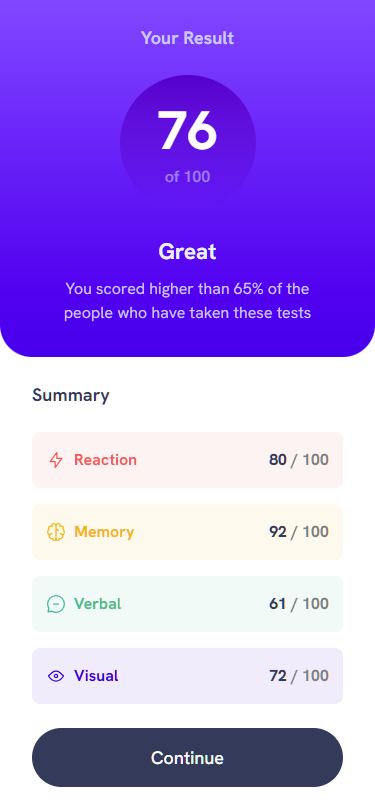
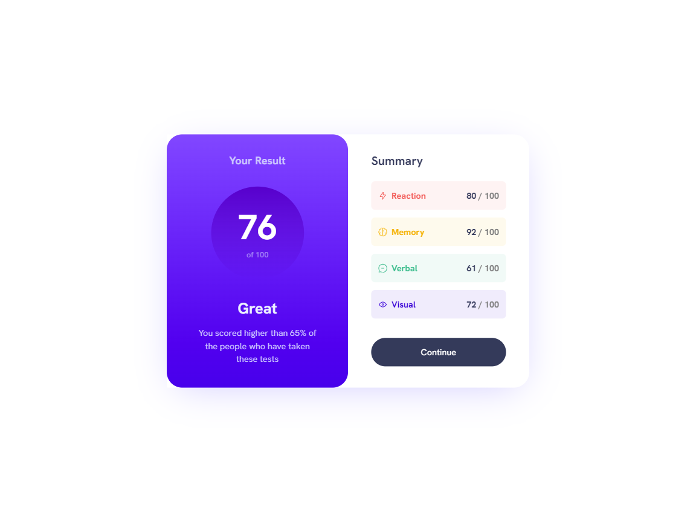

# Frontend Mentor - Results summary component solution

This is a solution to the [Results summary component challenge on Frontend Mentor](https://www.frontendmentor.io/challenges/results-summary-component-CE_K6s0maV). Frontend Mentor challenges help you improve your coding skills by building realistic projects. 

## Table of contents

- [Overview](#overview)
  - [The challenge](#the-challenge)
  - [Screenshot](#screenshot)
  - [Links](#links)
- [My process](#my-process)
  - [Built with](#built-with)
  - [What I learned](#what-i-learned)
  - [Continued development](#continued-development)
  - [Useful resources](#useful-resources)
- [Author](#author)

## Overview

### The challenge

Users should be able to:

- View the optimal layout for the interface depending on their device's screen size
- See hover and focus states for all interactive elements on the page

### Screenshot

Mobile view:


Desktop view:


### Links

- React Solution URL: [React](https://github.com/JustANipple/results-summary-component-react/blob/master/app/page.js)
- Live Site URL: [Live on Vercel](https://results-summary-component-react-azure.vercel.app)

## My process

### Built with

- Semantic HTML5 markup
- CSS custom properties
- Flexbox
- CSS Grid
- Mobile-first workflow
- [React](https://reactjs.org/) - JS library
- [Next.js](https://nextjs.org/) - React framework

### What I learned

I have made a step into React, and i'm proud to share with you my first component

In the first place, getting used to React, npm, next.js and directory organization was hard, but i made my best to create something reusable and clean

I love how everything can be grouped into a component, so this is what it looks like:

```js
import Result from '../components/result'
import Summary from '../components/summary'

export default function ResultSummary() {
  return (
    <main>
      <Result></Result>
      <Summary></Summary>
    </main>
  );
}
```

### Continued development

I will be working a lot with React and next.js to make good looking and interactive websites

### Useful resources

- [Learn React](https://react.dev/learn) - If you need a place to start learning React, there's a dedicated page to make your first steps into it
- [Next.js](https://nextjs.org/docs/getting-started/installation) - This helps you getting started with next.js

## Author

- Frontend Mentor - [@JustANipple](https://www.frontendmentor.io/profile/JustANipple)